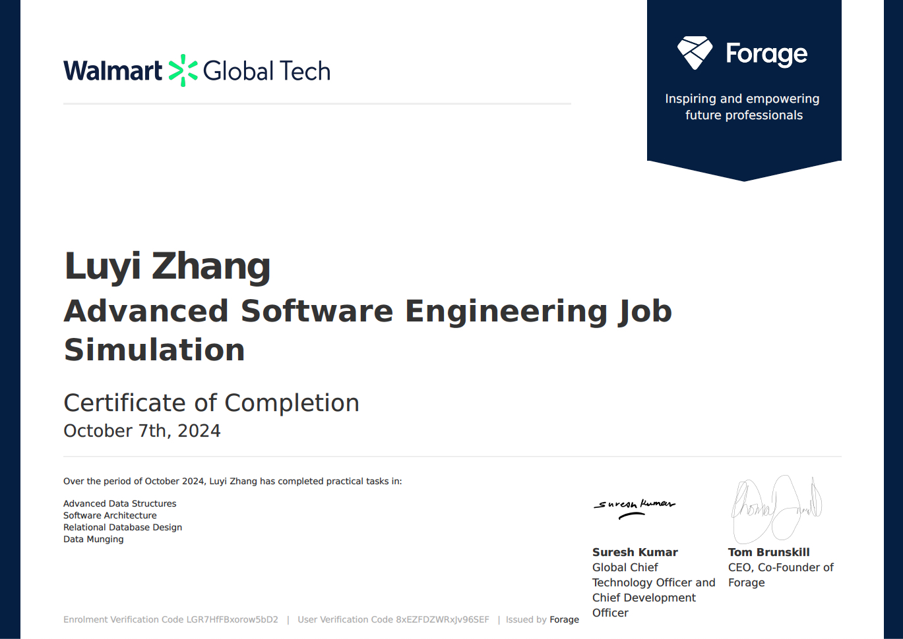

# Walmart-Advanced-Software-Engineering-Virtual-Experience
This repository contains solutions to four key tasks involving data structures, UML design, database design, and data processing.

## Certificate

## Tasks

### 1. **MaxHeap Implementation**
- **Objective**: Implement a custom priority queue using a modified heap where each node has `2^x` children (referred to as the "power of two max heap").
- **Key Functions**:
  - `insert()`: Inserts an element into the heap while maintaining the max heap property.
  - `pop_max()`: Removes and returns the maximum element from the heap.
- **Implementation**: The heap is dynamically adjusted based on the value of `x`, which is passed during heap initialization.

### 2. **UML Class Diagram**
- **Objective**: Design a UML class diagram for a dynamically reconfigurable data processor.
- **Key Components**:
  - `DataProcessor`: Configures and processes data points based on different modes (Dump, Passthrough, Validate).
  - `Database`: Interface for databases (Postgres, Redis, Elastic) used by the processor.
  - `Mode`: Defines how data is processed by interacting with the database.
- **Modes**:
  - `DumpMode`: Discards data.
  - `PassthroughMode`: Inserts data into a database.
  - `ValidateMode`: Validates data before insertion into a database.

### 3. **ERD (Entity Relationship Diagram) Design**
- **Objective**: Design an ERD for Walmart’s pet department, which consolidates data from multiple sources into a single, normalized relational database.
- **Key Entities**:
  - `Product`: Represents pet products (food, toys, apparel) with attributes specific to each type.
  - `Manufacturer`: Links products to their respective manufacturers.
  - `Animal`: Associates products with one or more animals.
  - `Customer` and `Transaction`: Tracks customer purchases and their associated products.
  - `Shipment` and `Location`: Tracks product shipments to Walmart locations.
- **Normalization**: The design ensures data is normalized, reducing redundancy and improving query efficiency.

### 4. **Data Munging and SQLite Insertion**
- **Objective**: Read and process shipping data from multiple CSV files, normalize it, and insert it into an SQLite database.
- **Steps**:
  - **Process `shipping_data_0.csv`**: Directly read and insert the shipment data into the database.
  - **Process `shipping_data_1.csv` and `shipping_data_2.csv`**: Merge product data from `shipping_data_1.csv` with location data from `shipping_data_2.csv` based on the `shipment_identifier`.
  - **Insert Data into SQLite**: Use `sqlite3` to insert the processed data into the database.
- **Tools Used**: Python’s `csv` and `sqlite3` libraries for data processing and database management.
